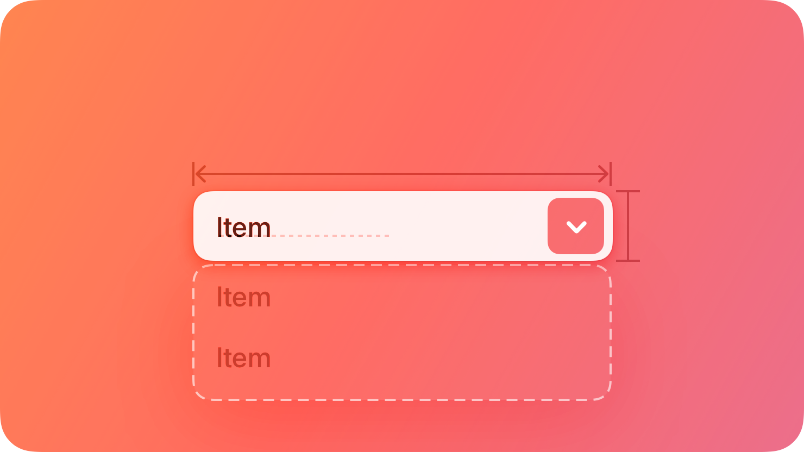
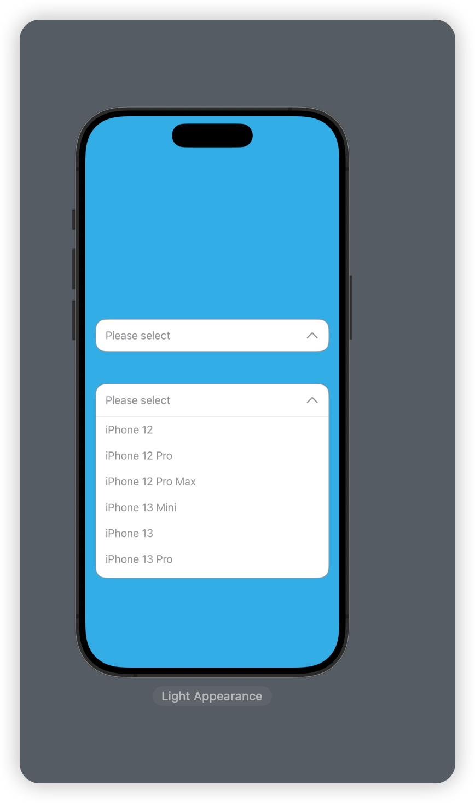
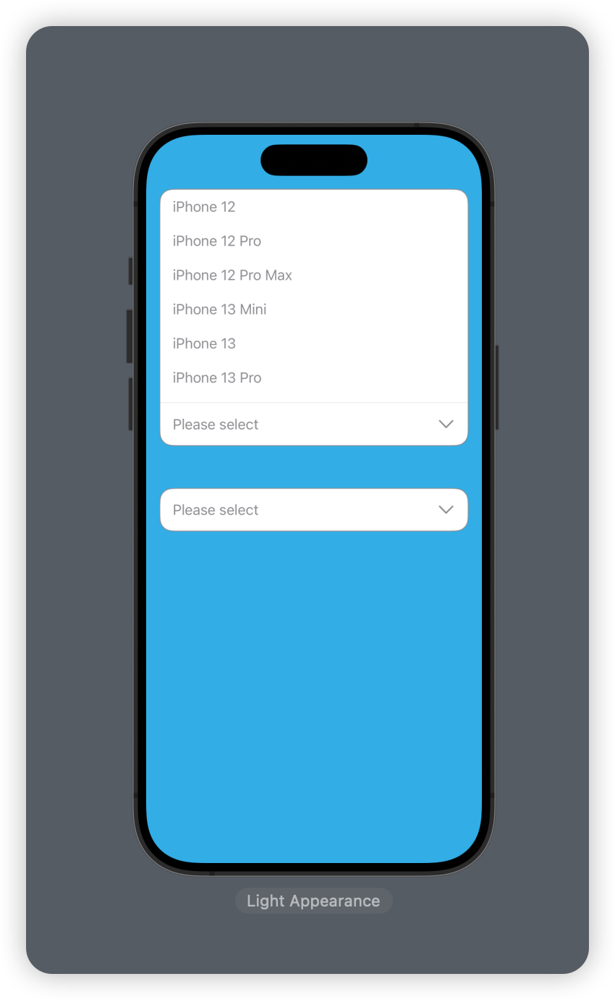

<p align="center">


<p align="center"> <b> LCDropDownPicker is a custom animation type drop-down menu bar library written in SwiftUI.</b></p>


<p align="center">
  <a href="https://swiftpackageindex.com/DevLiuSir/LCDropDownPicker">
        
    </a>
    <a href="https://swiftpackageindex.com/DevLiuSir/LCDropDownPicker">
        
    </a>
    


<a href="https://twitter.com/LiuChuan_"></a>
</p>


### Design

| **Preview 1** | **Preview 2** |
|:---|:--- |
|  | |


## How to use

```swift
     LCDropDownPicker(
                    selectedItem: $selectedOption,
                    placeholder: "Select an option",
                    position: .top,
                    menuItems: items,
                    lightModeBackgroundColor: .white,
                    darkModeBackgroundColor: .black,
                    lightModeTextColor: .black,
                    darkModeTextColor: .white,
                    isBorder: false,
                    borderColor: .gray,
                    expandedHeight: 300,
                    cornerRadius: 15
                )
                .padding()
                .onChange(of: selectedOption) { (oldValue, newValue) in
                    print("Selected: \(newValue), previous old value: \(oldValue)")
                }
                
```

## SwiftPackage

Add `https://github.com/DevLiuSir/LCDropDownPicker ` in the [“Swift Package Manager” tab in Xcode](https://developer.apple.com/documentation/xcode/adding_package_dependencies_to_your_app).


## License

MIT License

Copyright (c) 2024 Marvin


## Author

| [](https://github.com/DevLiuSir)  |  [DevLiuSir](https://github.com/DevLiuSir)<br/><br/><sub>Software Engineer</sub><br/> [][1] [][2] [][3]|
| :------------: | :------------: |

[1]: https://twitter.com/LiuChuan_
[2]: https://github.com/DevLiuSir
[3]: https://devliusir.com/


